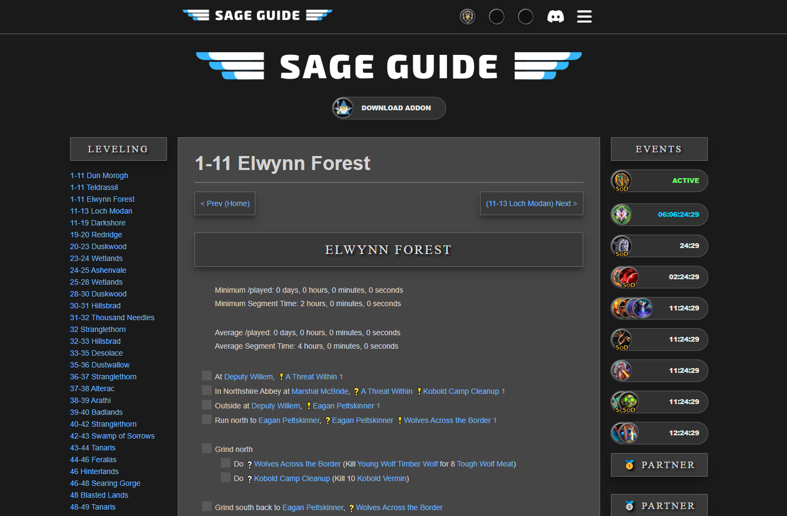
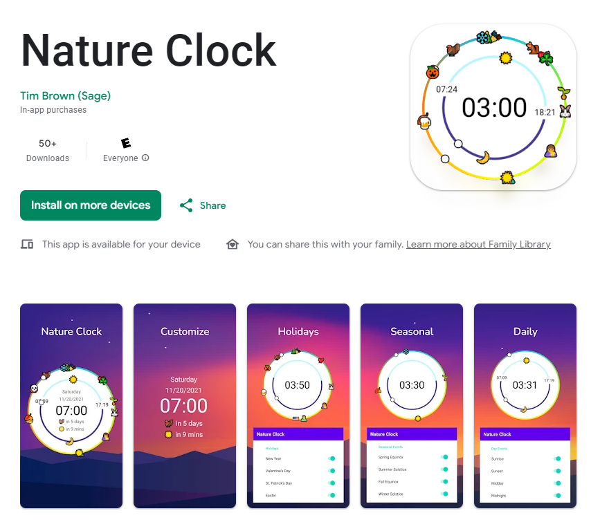
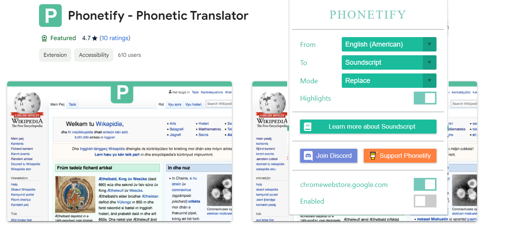
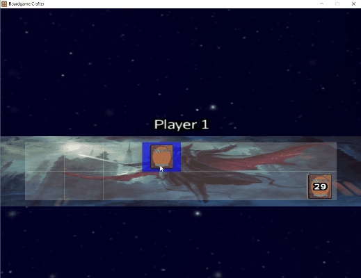
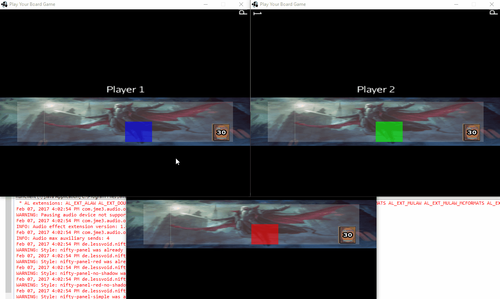
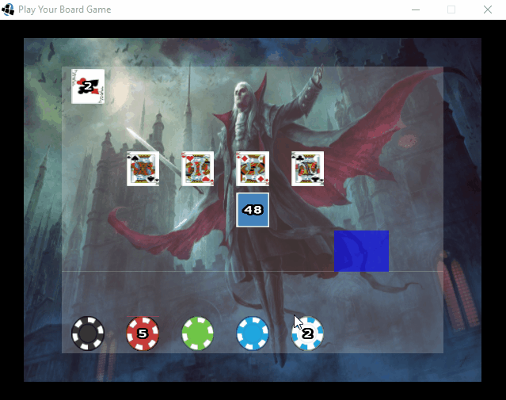
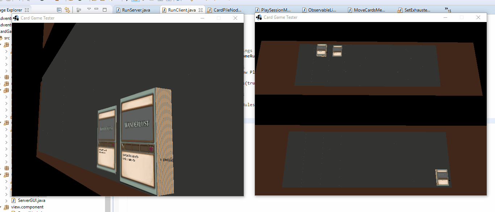
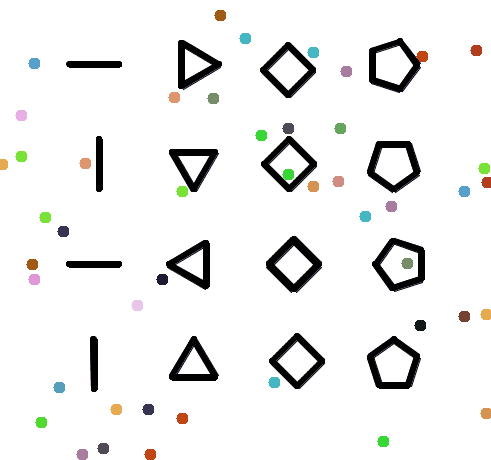

<h1> Hey there, welcome to my github!</h1>

## 👨‍💻 My skills

  
  
  
  
  
  
  
  
<!--    -->
  
  
  
  
  
  
  
  
  
  
  
  
  
  
  
  
  
  
  
  
  

## 🎨 My projects
## [Sage Guide](https://sageguide.netlify.app/) 

## [Nature Clock](https://tinyurl.com/natureclock)

## [Phonetify](https://tinyurl.com/phonetify)  

## Board Game Studio

## Polygonal Physics

## Factions
https://github.com/timjbrown/timjbrown/assets/25399749/de1b0317-402b-498d-bbe7-7c67e3ef6001
