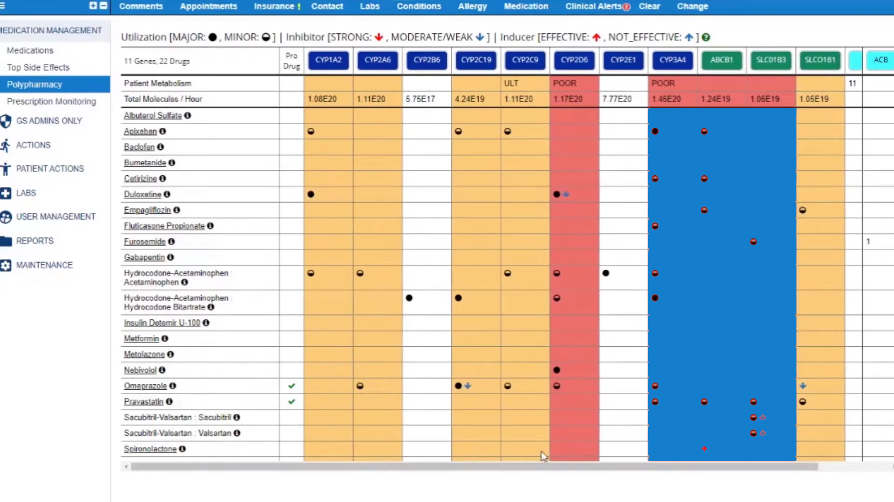

<h1> Hey there, welcome to my github!</h1>

## 💪 Some skills:
<!--   Generate badges: https://shields.io/badges -->
<!--   Pick icons: https://simpleicons.org -->

  
  
  
  
  

  
  
  
  
  
  
  
  
  
  

  
  
  
  
  
  

  
  
  
  
  
  
  
  

  
  
  
  
  
  
  
  

  
  
  
  
  

<!--

-->

## 👨‍💻 Some projects:
## [Sage Guide](https://sageguide.netlify.app/) 

## [Wheel of the Year Widget](https://play.google.com/store/apps/details?id=com.sage.natureclock)

## [Phonetify](https://chromewebstore.google.com/detail/ginngbneckjdbhnkgblaccihjheaajbp)  

<!--
## Board Game Studio

-->

## Goldblatt Systems

<!--
## Polygonal Physics

## MOBA Game
https://github.com/timjbrown/timjbrown/assets/25399749/de1b0317-402b-498d-bbe7-7c67e3ef6001
-->
